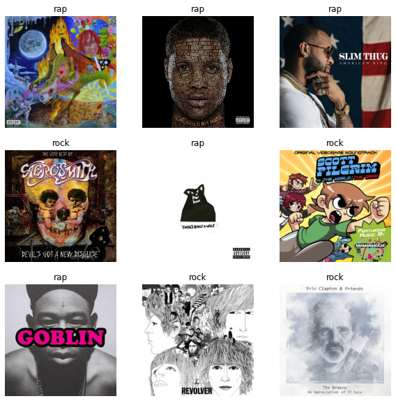
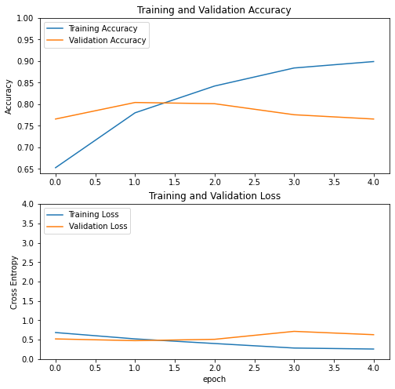
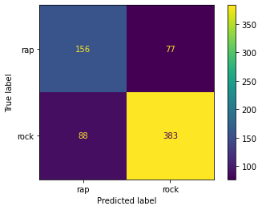
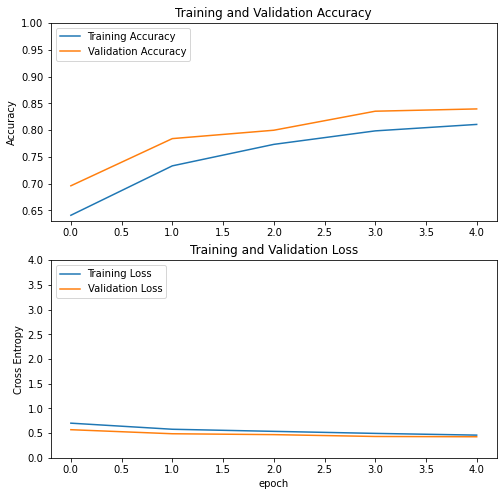

# Deep Learning MVP

For the MVP for this project I made a binary classification model for rock and rap albums. For the final project I'm planning on creating a multiclass model that leverages transfer learning for albums in the genres: rap, rock, holiday, latin, jazz, and country. To classify genres I took any album that appeared on the rap, rock, holiday, latin, jazz, and country billboard charts for the past 20 years and added it to its respective genre list. I didn't want to deal with albums that were in multiple genres, so if an album appeared on more than one list I took it off both lists. After that I used Spotifys API to download the album artwork from the genre lists and used it to create these classification models. 

For the rap vs rock classifier I started with a CNN model trained from scratch. It was significantly over fitting the training data so I added a drop out layer and trained again. 

After adding a drop out layer my validation accuracy got significantly better but the recall on the rap category got slightly worse 

